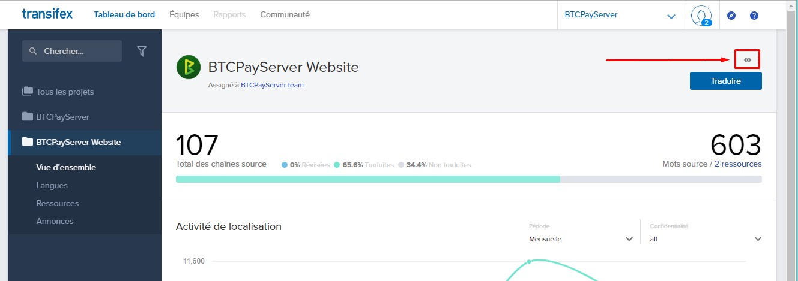

# Translating BTCPay Server

- [Translating BTCPay Server](#translating-btcpay-server)
  - [Why translations matter](#why-translations-matter)
  - [Requirements](#requirements)
  - [Step 1: View Existing Translations](#step-1-view-existing-translations)
  - [Step 2: Start New Translation](#step-2-start-new-translation)
  - [Step 3: Translation](#step-3-translation)
  - [Translation Tips](#translation-tips)
    - [**Variables**](#variables)
    - [**Notifications**](#notifications)
  - [View Checkout Page For Context](#view-checkout-page-for-context)
  - [Get help, ask questions](#get-help-ask-questions)

## Why translations matter

Translating BTCPay Server into multiple languages lets us reach a broader user base for the software and also decreases friction in the invoice checkout for customers that might not understand English perfectly.

## Requirements

BTCPay Server uses a translation platform called Transifex to allow contributors to translate it into more languages.

The community is currently working on translating the [invoice checkout page](https://www.transifex.com/btcpayserver/btcpayserver/dashboard/) and the [official website](https://www.transifex.com/btcpayserver/btcpayserver-website/dashboard/). 

After a translation has been made on Transifex, the submittal process is completely automated and merged periodically into the BTCPay repository. Translations provided outside of Transifex, such as pull requests in Github will not be accepted. 

----

## Step 1: View Existing Translations

First verify the language translation you would like to complete has not been started already. If it has already been started, you can complete the remaining strings. If you don't see the language you are looking for, make a request to add it to the project and to be a translator for it. 

## Step 2: Start New Translation

Look for the language you would like to translate. Some languages have the option for several regions. If your language request was denied, the reason is likely that the language is already being translated. 

## Step 3: Translation

Line 1: Translate your Country-Code.

    Example for Brazilian Portuguese
     'en' translates to 'pt-BR'

Line 2: The name of your language, in your language.

:::tip
This is the language name that will appear in user interface language dropdowns. 
:::
    Example for French
     'English' translates to 'Français'

----


## Translation Tips

### **Variables**
```
{{Words}} like this will be replaced by a variable depending on user choices.
{{btcDue}} Example: 10
{{cryptoCode}} Example: BTC
```

They should not be translated, but they need to remain in the correct place in your translated string because their placement will vary by language.
```
French Example:
"Return to StoreName" translates to "Retourner sur {{storeName}}"

Japanese Example:
"Return to StoreName" translates to "{{storeName}} に戻る"
```

### **Notifications**
To stay up to date with new strings - enable alerts for new strings needing to be translated by enabling the watch language feature in Transifex.

Click on the "eye" icon (in red in the following screenshot).



You have to click it for the each project you wish to follow.

----

## View Checkout Page For Context

Need context for a string?

Visit the BTCPay Server demo store [checkout page](https://store.btcpayserver.org/).

## Get help, ask questions

If you have any questions about translating, join the [#Translations channel](https://chat.btcpayserver.org/btcpayserver/channels/translations) on Mattermost.
